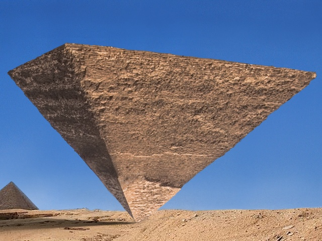
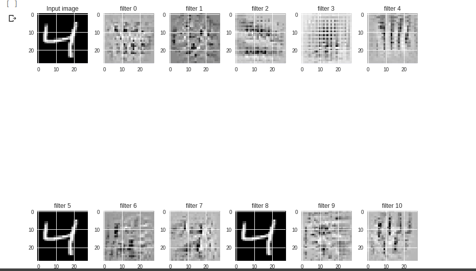
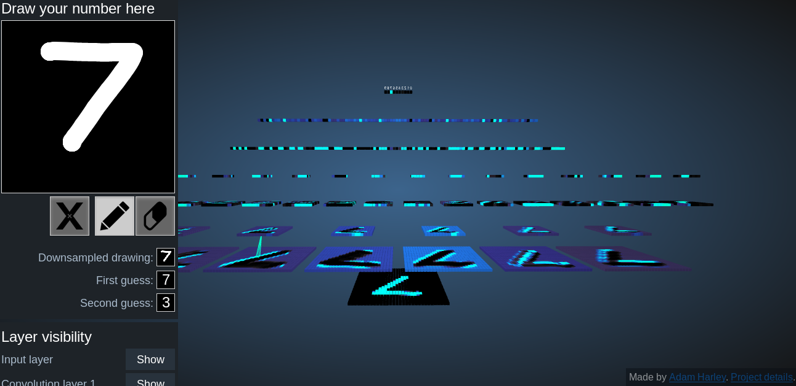

## Digit Recognition - MNIST dataset

### Objectives

Implement CNN by training them on a model with MNIST dataset

    - Loading MNIST dataset in keras    
    - Using Data augumentation in keras 
    - **Neural Network Modelling**
    - Visuvalizing specific layers 

### Packages Used

    - Python 3.6
    - Keras 2.2.4 
    - Numpy 

#### Approaches 

Details about MNIST can be found [here](http://yann.lecun.com/exdb/mnist/)

**Data augumentation**

```
Image augumentation 
datagen = ImageDataGenerator(rotation_range=45,width_shift_range=0.2,
    height_shift_range=0.2,
    zoom_range=0.5)
```

Since there would be a slight variation in angles we are giving a 0'-45' rotation.

**Neural Network Architecture Lesson - 1**

**Neural Network Modelling**


```'
model = Sequential()

 
model.add(Convolution2D(32, 7, 1, activation='relu', input_shape=(28,28,1)))
model.add(Convolution2D(32, 1, 7, activation='relu'))

model.add(MaxPooling2D(pool_size = (2, 2)))


model.add(SeparableConv2D(16, 3, 3, activation='relu'))
model.add(SeparableConv2D(16, 3, 3, activation='relu'))

model.add(MaxPooling2D(pool_size = (2, 2)))


model.add(Convolution2D(10, 1))
model.add(GlobalAveragePooling2D())

model.add(Activation('softmax'))

```
its is recognition model .Read it again it is a re- cognition model .

Know the difference between Object Recognition and Object detection


Object Recognition: which object is depicted in the image?

Object detection: where is this object in the image?

Read [this](https://dsp.stackexchange.com/questions/12940/object-detection-versus-object-recognition)


Construction for a re-cognition model should be in a shape of a inverted-pyramid 




7x1 and 1x7 kernel - could give a large first - receptive field (some of the terms are framed by me just take the meaning dont google it you cant find )

Max pooling after two layers of Conv2D - proper downsampling without loss of much content . Dont use max pooling after a single layer of cnn

Global average pooling -a final shot in neural network .read [here](https://alexisbcook.github.io/2017/global-average-pooling-layers-for-object-localization/) also [here](https://arxiv.org/pdf/1312.4400.pdf)


**Visuvalization**

*codes are provided in notebook for visuvalization*

You can model the neural network by visuvalizing the each layer for different type of constructs




You can use this( http://scs.ryerson.ca/~aharley/vis/conv/ )website for better 3D visuvalization of filters




